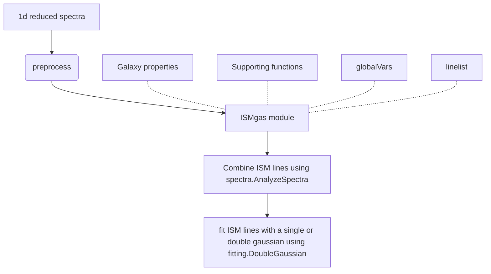

# ISMgas

ISMgas is a python module used to analyze absorption line kinematics of Interstellar Medium gas. The module takes a 1D spectra as an input and extracts key kinematic diagnostics (such as velocity centroid of absorption) by fitting the absorption profile with multiple gaussian profiles. 

### Module flowchart 

### Tutorials
- [Fit a double Gaussian to an absorption profile using ISMgas.fitting](fitting/README.md)
- [Introduction to the ISMgas.AnalyzeSpectra baseclass](spectra/README.md)

### Papers using ISMgas 

- ['Resolved velocity profiles of galactic winds at Cosmic Noon' by Vasan G.C., et al (2022)](https://ui.adsabs.harvard.edu/abs/2022arXiv220905508K/abstract).

